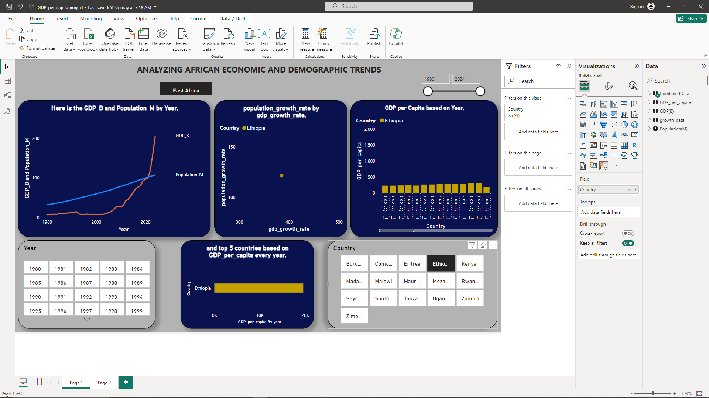
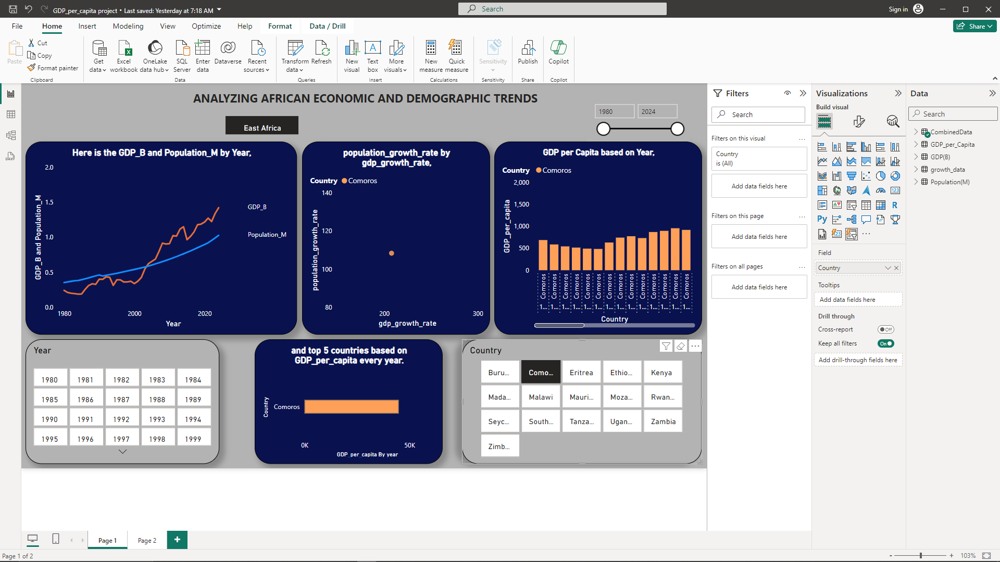
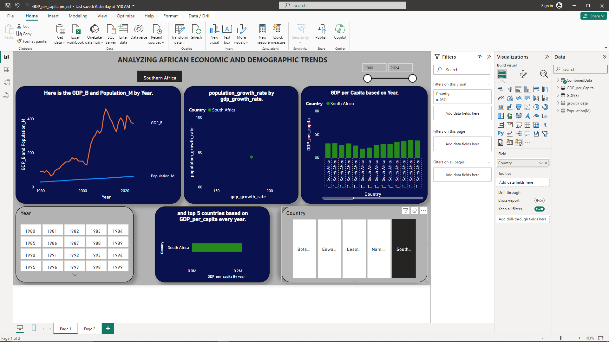
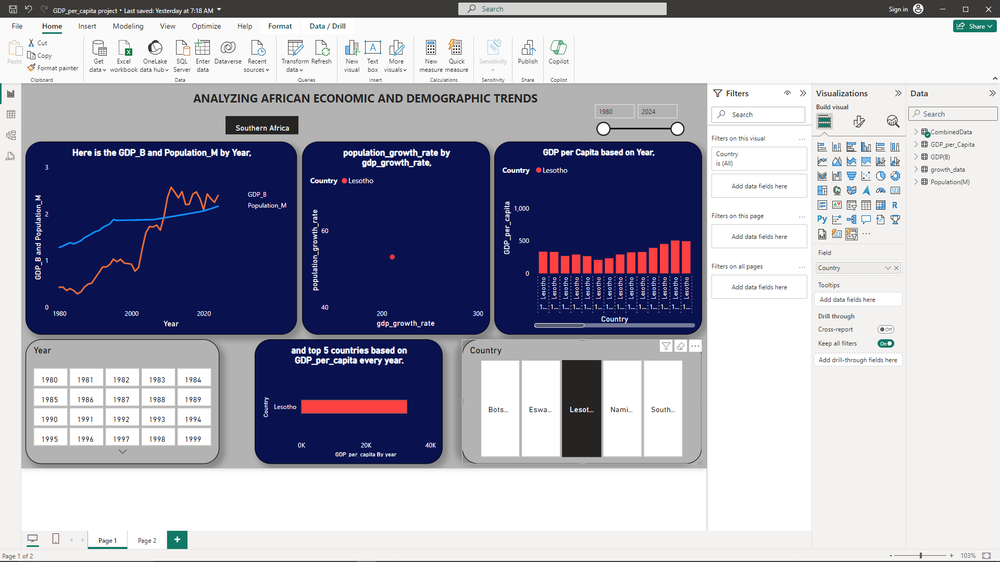
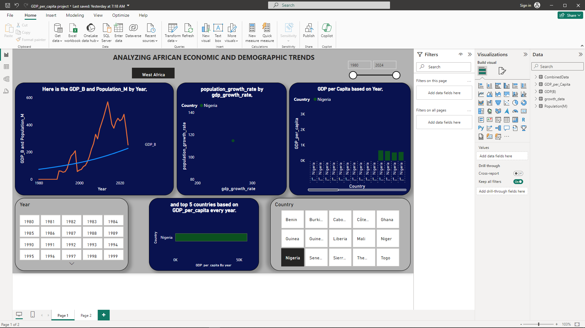
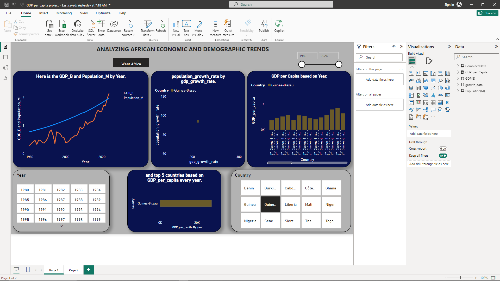

# Analyzing African economic and demographic trends.

## Objective: 
Analyze and visualize the relationship between GDP and Population growth across different African countries and years. Identify trends and correlations in the economic and demographic data. 

Through this project I honed my skills;
- Data cleaning and transformation
- Data visualization
- Statistics
- Data modeling
- Problem-solving
- Communication

## Data description:
I gathered the GDP in billions(US dollars) and population in millions datasets of African countries classified as the Sub-Saharan from [IMF website](https://www.imf.org/en/Publications/WEO/weo-database/2024/April).

I converted the datasets to an analyzable format using Python:
- [GDP](Files/convert_GDP.ipynb)
- [Population](Files/convert_pop.ipynb)

where the final structure was 

GDP dataset:
Columns: 
- Country - Names of the African countries.
- Year - Each year a record taken.
- GDP(B) - Holds the GDP values of each country every year.

Population dataset:
Columns:
- Country
- Year
- Population(M)
  
---------------

Loaded the datasets into a database in SQL server,

prepared the datasets for easy analysis by [combining them](Files/CREATE_VIEW.sql), calculated the [gdp per capita](Files/GDP_per_Capita.sql), did a [trend analysis](Files/Trend_analysis.sql), calculated [yearly growth rates](Files/Yearly_Growth_Rate.sql), [correlation](Files/Correlation_analysis.sql) between population growth rate and GDP's, before diving into visualization using Power BI.

I connected the SQL database to Power BI and first did a Data Modeling;
- I created an active country to country relationship from *CombinedData* table to other tables.
  
- An inactive year to year relationship from *CombinedData* table to other tables to avoid ambiguity. Activated by creating measures and implementing USERELATIONSHIP() function in DAX.
  
- Created a *Region* column to classify the countries.

## Data Visualization

Having plotted gdp, population, and gdp per capita, I identified some trends.

For instance,

**Trends for GDP and population growth in Central Africa:**

Angola being the leading in GDP by 2024, there is a downward trend from 2017(122.02B) to 2020(57.14B) but then a recovery and grew up to 122.83B by 2022 before facing another down trend that is currently at 92.12B 

For the population growth, it has a consistent upward trend from 1980(8.27M) to 2024(37.89M)

Although Sao tome is lagging by 2024, there is a consistent upward trend from 2015(0.26B) to date(0.75B)

It's population still experiencing an upward trend since 1980(0.09M) now at (0.24M) _mmmh... still a small figure_ 

-------

For Angola and Sao tome, GDP and population appear not to be moving together. This means there is no much positive relationship between the two.

-------

**Trends for GDP and population growth in East Africa:**

Ethiopia took the lead from Kenya from 2022 based on GDP. It experienced a very steap upward trend from 2021(99.27B) to date (205.13B)

Population still experiencing an upward trend since 1980.

Comoros being the lagging country by 2024, has been experiencing a lot of troughs and crests in their GDP over the years. 

Population growth is still under upward trend since 1980.

**Trends for GDP and population growth in Southern Africa:**

South Africa experienced a massive upward trend from 2002(129.38B) to 2011(458.71B) before some fluctuations that are summing up to a down trend up-to-date (373.23B)

Population has been under an upward trend but not steep.

Lesotho. Having the least figures in both GDP and population, it's the lagging country in Southern Africa facing fluctuations in GDP while population facing an upward trend but not a steep trend.

**Trends for GDP and population growth in West Africa:**

After facing a massive upward trend from 1999(57.48B) to 2014(568.50B), Nigeria is currently having a downward trend.

It's population is under an upward trend to date. 

Guinea Bissau is the lagging country with a GDP of 2.15B after experiencing though upward but not a consistent trend.

For population, upward trend is evident over the years.

---------

After ranking countries based on GDP per capita by 2024, 

Top 5 Countries in 
**Central Africa**

| Rank | Country | GDP per capita(USD) |
| ------| -----|-------|
| 1 | Gabon| 9,306.02 |
| 2 | Equatorial Guinea| 6,734.59|
| 3 | Sao Tome and Principe|3,168.78|
| 4 | Republic of Congo | 2,456.97 |
| 5 | Angola | 2,431.58|

Top 5 from **East Africa**

| Rank | Country | GDP per capita(USD) |
| ------| -----|-------|
| 1 | Seychelles| 21,811.88 |
| 2 | Mauritius| 12,973.04|
| 3 | Zimbabwe|2,087.56|
| 4 | Kenya | 1,983.09 |
| 5 | Ethiopia | 1,909.98|

Top 5 from **Southern Africa**

| Rank | Country | GDP per capita(USD) |
| ------| -----|-------|
| 1 | Botswana| 7,874.26 |
| 2 | South Africa| 5,974.88|
| 3 | Namibia |4,745.35|
| 4 | Eswatini | 4,323.98 |
| 5 | Lesotho | 1,106.75|

Top 5 from **West Africa**

| Rank | Country | GDP per capita(USD) |
| ------| -----|-------|
| 1 | Cape Verde| 4,654.11 |
| 2 | Côte d'Ivoire| 2,717.41|
| 3 | Ghana |2,229.91|
| 4 | Senegal | 1,899.68 |
| 5 | Guinea | 1,650.58|

------
